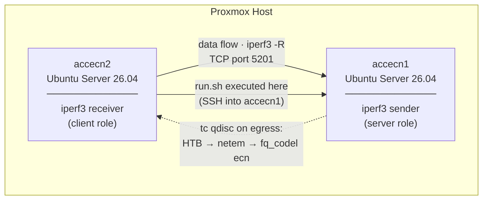

# AccECN TCP Experiment

Experiment comparing TCP throughput and congestion behavior across four modes:
**No ECN**, **Classic ECN** (RFC 3168), **AccECN** (RFC 9331), and **DCTCP+AccECN** —
using two Ubuntu Server 26.04 VMs on Proxmox. The orchestration scripts run on one of
the VMs (or any Linux host with SSH access to both) and control the experiment remotely
via SSH.

## Topology



> **Why `-R` (reverse)?** Traffic flows from server to client, so the `tc` qdisc applied
> on the server's egress shapes the experiment traffic. The client only sends ACKs.

## How It Works

For each mode (`none` → `classic` → `accecn` → `dctcp`) the orchestrator:

1. Configures `net.ipv4.tcp_ecn`, `net.ipv4.tcp_ecn_option`, and optionally
   `net.ipv4.tcp_congestion_control` on both VMs.
2. Applies a `tc` qdisc stack on the server's egress interface:
   - **HTB** — rate limiter (default `RATE=100mbit`)
   - **netem** — adds controlled delay and jitter (default `DELAY=25ms JITTER=2ms`)
   - **fq_codel ecn** — AQM with ECN marking (configurable `ECN_TARGET`, default `5ms`)
3. Starts `iperf3 -s` on the server and `iperf3 -c -R` on the client.
4. Samples `ss -tin` every 500 ms on **both** sides (client: RTT / receiver window; server: sender cwnd).
5. Captures the full TCP flow with `tcpdump`, then derives a small handshake pcap
   for quick SYN/SYN-ACK inspection.
6. After the transfer, collects `tc -s qdisc show` to record ECN marks and packet drops.
7. Downloads all artefacts and runs `analysis/parse-results.py` → `results/summary.csv`.

### ECN mode sysctl table

| Mode | `tcp_ecn` | `tcp_ecn_option` | `tcp_congestion_control` | Effect |
|------|-----------|-------------------|--------------------------|--------|
| `none` | 0 | — | cubic | No ECN; fq_codel drops instead of marking → throughput collapses |
| `classic` | 1 | 0 | cubic | RFC 3168 ECN; fq_codel marks; binary cwnd halving on each CE |
| `accecn` | 3 | 2 | cubic | RFC 9331 AccECN; ACKs carry exact CE count; Cubic still halves |
| `dctcp` | 3 | 2 | dctcp | DCTCP uses the AccECN CE count for proportional cwnd reduction |

## Experimental Results

All experiments ran on kernel **7.0.0-14-generic**, link rate **100 Mbit/s**,
one-way delay **25 ms ± 2 ms** (RTT ≈ 50 ms).

### Scenario 1 — Baseline (fq_codel target 5 ms, 1 stream)

| Mode | Recv throughput | fq_codel marks | fq_codel drops |
|------|----------------|----------------|----------------|
| No ECN | ~0.2 Mbps | 0 | 4 |
| Classic ECN | ~93 Mbps | 18 | 0 |
| AccECN | ~93 Mbps | 17 | 0 |
| DCTCP+AccECN | ~95 Mbps | 17 | 0 |

With the default 5 ms target, ECN marks are rare (~17 per 60 s run). Cubic's binary
halving is triggered infrequently, so Classic ECN, AccECN, and DCTCP perform similarly.
The dramatic difference is between **No ECN and everything else**: fq_codel drops packets
for non-ECN connections, causing Cubic to repeatedly halve and never recover.

### Scenario 2 — Aggressive marking (fq_codel target 1 ms, 1 stream)

| Mode | Recv throughput | fq_codel marks |
|------|----------------|----------------|
| No ECN | ~9 Mbps | 0 (drops) |
| Classic ECN | **82 Mbps** | ~40 |
| AccECN | **83 Mbps** | ~44 |
| DCTCP+AccECN | **95 Mbps** | **4 538** |

Reducing the target to 1 ms causes fq_codel to mark far more aggressively. This exposes
the key architectural difference:

- **Classic ECN / AccECN with Cubic**: each CE mark triggers a binary halving of cwnd
  (÷2), even if only a tiny fraction of packets were marked. With 40+ marks per run,
  throughput drops to ~82 Mbps.
- **DCTCP+AccECN**: DCTCP reads the exact CE-marked byte count from AccECN ACK options
  and scales the cwnd reduction proportionally to the congestion fraction. Despite
  receiving **4 538 marks**, throughput stays at **95 Mbps** — the same as with no
  congestion signal at all.

### Scenario 3 — Multiple competing flows (fq_codel target 1 ms, 4 streams)

| Mode | Recv throughput | Notes |
|------|----------------|-------|
| No ECN | ~12 Mbps | Per-flow drops cause repeated collapse across all streams |
| Classic ECN | ~95 Mbps | fq_codel isolates flows; marks spread evenly |
| AccECN | ~95 Mbps | Same as Classic with Cubic |
| DCTCP+AccECN | **96 Mbps** | Highest and most stable aggregate throughput |

With 4 parallel streams fq_codel's per-flow fair queuing distributes marks across flows,
reducing the synchronization penalty of binary halving. The aggregate gap between
Classic ECN and DCTCP narrows, but the sender-side **cwnd stability** difference remains
clearly visible in the `server-ss.log` time series.

### Summary: what differentiates each mode

| Observation | No ECN | Classic ECN | AccECN (Cubic) | DCTCP+AccECN |
|-------------|--------|-------------|----------------|--------------|
| Drops under congestion | yes | no | no | no |
| Throughput collapse | yes | no | no | no |
| cwnd oscillation (sawtooth) | severe | moderate | moderate | minimal |
| Marks absorbed proportionally | — | no | no | **yes** |
| Sensitive to mark frequency | — | **yes** | **yes** | no |

## Setup

### Prerequisites

- Two Ubuntu Server 26.04 VMs with SSH access between them (kernel ≥ 7.0 required for `tcp_ecn_option`).
- Passwordless `sudo` on each VM (required for `tc`, `tcpdump`, `sysctl`):

```bash
echo "$USER ALL=(ALL) NOPASSWD:ALL" | sudo tee /etc/sudoers.d/accecn
sudo chmod 440 /etc/sudoers.d/accecn
```

### 1. Configure

```bash
cp .env.example .env
# Edit .env with the real IPs, users, and ports of both VMs.
```

### 2. Verify access

```bash
./scripts/check.sh
```

### 3. Install VM dependencies

```bash
./scripts/provision.sh
# Installs: iproute2, iperf3, tcpdump, python3
```

## Running Experiments

```bash
# Quick smoke test (5 s per mode)
./scripts/run.sh 5

# Standard run — all 4 modes, 60 s each (recommended)
MODES="none classic accecn dctcp" ./scripts/run.sh 60

# Aggressive marking: expose DCTCP vs Cubic difference
MODES="none classic accecn dctcp" ECN_TARGET=1ms ./scripts/run.sh 60

# Multiple parallel streams + aggressive marking
MODES="none classic accecn dctcp" ECN_TARGET=1ms STREAMS=4 ./scripts/run.sh 60

# Custom network conditions
RATE=50mbit DELAY=50ms JITTER=5ms ./scripts/run.sh 60
```

Results are saved under `results/<timestamp>-<mode>/`. Each directory also contains a
`params.txt` with the exact environment variables used for that run.

## Analysis

```bash
# (Re-)generate summary.csv from all result directories
python3 analysis/parse-results.py

# Generate results/comparison.png (4-panel comparison chart)
python3 analysis/plot-results.py

# Validate packet captures for ECN/AccECN evidence
python3 analysis/validate-pcaps.py
```

Both scripts work from any working directory; paths are resolved relative to the script
location. The chart adapts automatically to whichever modes are present in the data.

### Output files per run

| File | Contents |
|------|----------|
| `iperf-client.json` | Full iperf3 JSON (per-second intervals + summary) |
| `iperf-server.json` | Server-side iperf3 JSON |
| `ss-samples.log` | Client `ss -tin` samples every 500 ms (RTT, receiver window) |
| `server-ss.log` | Server `ss -tin` samples every 500 ms (sender cwnd) |
| `flow.pcap` | Full tcpdump capture for `tcp port 5201` (verify AccECN options and ECT/CE marking) |
| `handshake.pcap` | SYN/SYN-ACK packets extracted from `flow.pcap` for quick ECN setup inspection |
| `qdisc.log` | `tc qdisc show` at test start |
| `qdisc-final.log` | `tc -s qdisc show` at test end (`ecn_mark`, `pkt_dropped`) |
| `params.txt` | Run parameters: `rate`, `delay`, `ecn_target`, `streams` |
| `server-ecn.log` | sysctl state on server after configuration |
| `client-ecn.log` | sysctl state on client after configuration |

### summary.csv columns

| Column | Description |
|--------|-------------|
| `mode` | `none`, `classic`, `accecn`, or `dctcp` |
| `ecn_target` | fq_codel marking threshold used in this run |
| `streams` | Number of parallel iperf3 streams |
| `throughput_recv_mbps` | Mean receive throughput over the full run |
| `throughput_min_mbps` | Minimum per-second throughput (worst-case interval) |
| `throughput_stddev_mbps` | Std deviation of per-second throughput |
| `ecn_mark` | ECN marks issued by fq_codel |
| `pkt_dropped` | Packets dropped by fq_codel |
| `rtt_mean_ms` | Mean RTT from `ss` samples |
| `cwnd_mean` | Mean sender cwnd from `server-ss.log` |
| `cwnd_min` | Minimum sender cwnd (captures worst congestion response) |

`validate-pcaps.py` writes `results/pcap-validation.csv` with packet-level evidence:
ECT/CE packets, CE packets, TCP AE-bit packets, AccECN option packets, and SYNs that
look like Classic ECN or AccECN setup.

## AccECN Kernel Requirement

AccECN requires `net.ipv4.tcp_ecn_option` to exist in `/proc/sys`. This sysctl was
added in Linux 6.x. If it is absent the `accecn` and `dctcp` modes exit with an error —
this is expected on older kernels.

```bash
sysctl net.ipv4.tcp_ecn          # must accept value 3 for AccECN initiation
sysctl net.ipv4.tcp_ecn_option   # must return 0, 1, 2, or 3
```

DCTCP is available as a loadable kernel module and is loaded automatically by
`configure-ecn.sh` when the `dctcp` mode is selected:

```bash
sudo modprobe tcp_dctcp
```
