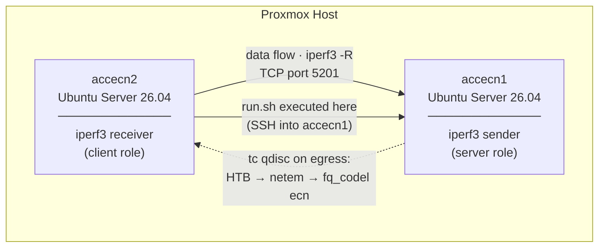

# AccECN TCP Experiment

Experiment comparing TCP throughput and congestion behavior across three ECN modes:
**No ECN**, **Classic ECN** (RFC 3168), and **AccECN** (RFC 9331) — using two Ubuntu
Server 26.04 VMs on Proxmox. The orchestration scripts run on one of the VMs (or any
Linux host with SSH access to both) and control the experiment remotely via SSH.

## Topology



> **Why `-R` (reverse)?** Traffic flows from server to client, so the `tc` qdisc applied
> on the server's egress shapes the experiment traffic. The client only sends ACKs.

## How It Works

For each mode (`none` → `classic` → `accecn`) the orchestrator:

1. Configures `net.ipv4.tcp_ecn` and `net.ipv4.tcp_ecn_option` on both VMs.
2. Applies a `tc` qdisc stack on the server's egress interface:
   - **HTB** — rate limiter (default `RATE=100mbit`)
   - **netem** — adds controlled delay and jitter (default `DELAY=25ms JITTER=2ms`)
   - **fq_codel ecn** — AQM with ECN marking (target 5 ms, limit 1000 packets)
3. Starts `iperf3 -s` on the server and `iperf3 -c -R` on the client.
4. Samples `ss -tin` every 500 ms on **both** sides (client: RTT / receiver window; server: sender cwnd).
5. Captures the TCP handshake with `tcpdump` to verify ECN option negotiation.
6. After the transfer, collects `tc -s qdisc show` to record ECN marks and packet drops.
7. Downloads all artefacts and runs `analysis/parse-results.py` → `results/summary.csv`.

### ECN mode sysctl table

| Mode | `tcp_ecn` | `tcp_ecn_option` | Effect |
|------|-----------|-------------------|--------|
| `none` | 0 | — | No ECN; fq_codel drops instead of marking → throughput collapses |
| `classic` | 1 | 0 | RFC 3168 ECN; fq_codel marks; binary cwnd halving on CE |
| `accecn` | 1 | 2 | RFC 9331 AccECN; ACKs carry exact CE count; proportional response possible |

### Key finding

With `fq_codel ecn` enabled on the qdisc, a connection that **does not support ECN**
receives **packet drops** instead of marks. TCP (Cubic) reacts to every drop with a
halving of the congestion window, leading to throughput collapse (~0.2 Mbps vs ~92 Mbps).

Classic ECN and AccECN both avoid drops entirely. The difference between them becomes
visible with multiple competing streams or when using DCTCP (which exploits the
per-ACK CE count provided by AccECN for proportional window reduction).

## Setup

### Prerequisites

- Two Ubuntu Server 26.04 VMs with SSH access between them (kernel ≥ 7.0 required for `tcp_ecn_option`).
- Passwordless `sudo` on each VM (required for `tc`, `tcpdump`, `sysctl`):

```bash
echo "$USER ALL=(ALL) NOPASSWD:ALL" | sudo tee /etc/sudoers.d/accecn
sudo chmod 440 /etc/sudoers.d/accecn
```

### 1. Configure

```bash
cp .env.example .env
# Edit .env with the real IPs, users, and ports of both VMs.
```

### 2. Verify access

```bash
./scripts/check.sh
```

### 3. Install VM dependencies

```bash
./scripts/provision.sh
# Installs: iproute2, iperf3, tcpdump, python3
```

## Running Experiments

```bash
# Quick smoke test (5 s per mode)
./scripts/run.sh 5

# Standard run (60 s per mode — recommended)
./scripts/run.sh 60

# Multiple parallel streams to stress ECN fairness (4 streams, 60 s)
STREAMS=4 ./scripts/run.sh 60

# Custom network conditions
RATE=50mbit DELAY=50ms JITTER=5ms ./scripts/run.sh 60
```

Results are saved under `results/<timestamp>-<mode>/`.

## Analysis

```bash
# (Re-)generate summary.csv from all result directories
python3 analysis/parse-results.py

# Generate results/comparison.png (4-panel comparison chart)
python3 analysis/plot-results.py
```

Both scripts work from any working directory; paths are resolved relative to the
script location.

### Output files per run

| File | Contents |
|------|----------|
| `iperf-client.json` | Full iperf3 JSON (intervals + summary) |
| `iperf-server.json` | Server-side iperf3 JSON |
| `ss-samples.log` | Client `ss -tin` samples (RTT, receiver window) |
| `server-ss.log` | Server `ss -tin` samples (sender cwnd) |
| `handshake.pcap` | tcpdump capture of TCP SYN/SYN-ACK (verify ECN options) |
| `qdisc.log` | `tc qdisc show` at test start |
| `qdisc-final.log` | `tc -s qdisc show` at test end (ecn_mark, pkt_dropped) |
| `server-ecn.log` | sysctl state on server after configuration |
| `client-ecn.log` | sysctl state on client after configuration |

### summary.csv columns

| Column | Description |
|--------|-------------|
| `throughput_recv_mbps` | Mean receive throughput |
| `throughput_min_mbps` | Minimum per-second throughput (worst-case interval) |
| `throughput_stddev_mbps` | Std deviation of per-second throughput |
| `ecn_mark` | ECN marks issued by fq_codel (0 in `none` mode) |
| `pkt_dropped` | Packets dropped by fq_codel (>0 in `none` mode) |
| `rtt_mean_ms` | Mean RTT from `ss` samples |
| `cwnd_mean` | Mean sender cwnd from `server-ss.log` |

## Making AccECN vs Classic ECN Difference Visible

With a single Cubic flow both modes behave identically (Cubic does not use the
per-mark count). To expose the AccECN advantage:

| Approach | How |
|----------|-----|
| Multiple streams | `STREAMS=4 ./scripts/run.sh 60` |
| DCTCP congestion control | On both VMs: `sysctl -w net.ipv4.tcp_congestion_control=dctcp` before running |
| More aggressive AQM marking | Reduce `fq_codel target` to `1ms` in `scripts/setup-qdisc.sh` |

## AccECN Kernel Requirement

AccECN requires `net.ipv4.tcp_ecn_option` to exist in `/proc/sys`. This sysctl was
added in Linux 6.x. If it is absent the `accecn` mode exits with an error — this is
expected on older kernels.

```bash
sysctl net.ipv4.tcp_ecn_option   # must return 0, 1, or 2
```
