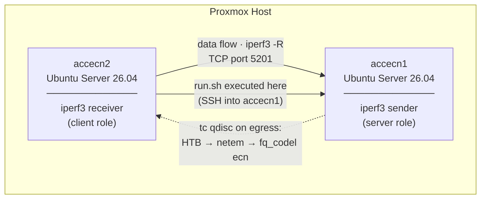
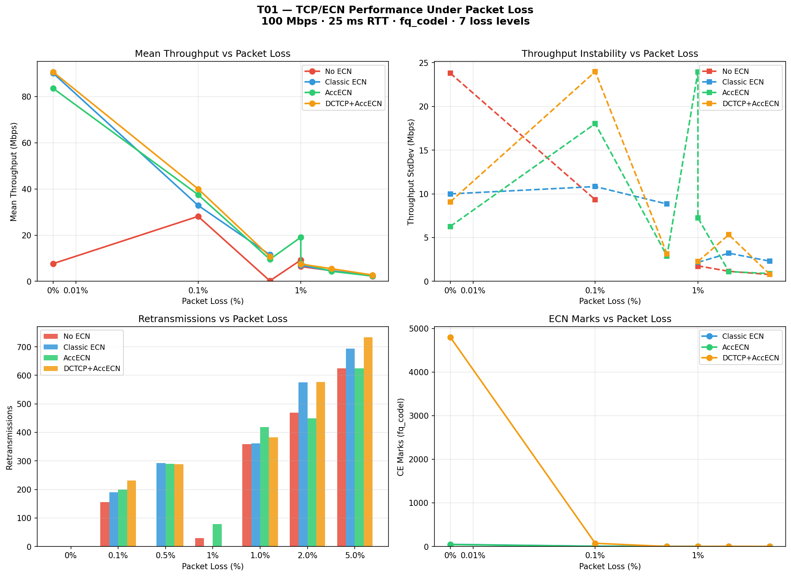
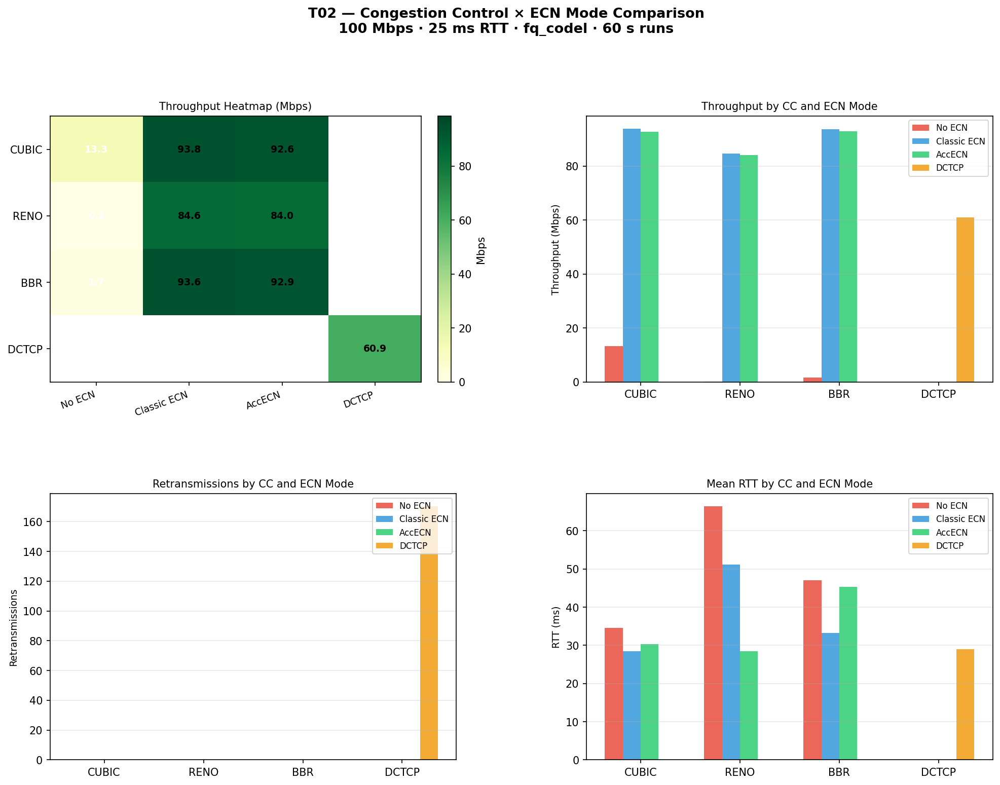

# AccECN TCP Experiment

Experiment comparing TCP throughput and congestion behavior across four modes:
**No ECN**, **Classic ECN** (RFC 3168), **AccECN** (RFC 9331), and **DCTCP+AccECN** —
using two Ubuntu Server 26.04 VMs on Proxmox. The orchestration scripts run on one of
the VMs (or any Linux host with SSH access to both) and control the experiment remotely
via SSH.

## Topology



> **Why `-R` (reverse)?** Traffic flows from server to client, so the `tc` qdisc applied
> on the server's egress shapes the experiment traffic. The client only sends ACKs.

## How It Works

For each mode (`none` → `classic` → `accecn` → `dctcp`) the orchestrator:

1. Configures `net.ipv4.tcp_ecn`, `net.ipv4.tcp_ecn_option`, and optionally
   `net.ipv4.tcp_congestion_control` on both VMs.
2. Applies a `tc` qdisc stack on the server's egress interface:
   - **HTB** — rate limiter (default `RATE=100mbit`)
   - **netem** — adds controlled delay and jitter (default `DELAY=25ms JITTER=2ms`)
   - **fq_codel ecn** — AQM with ECN marking (configurable `ECN_TARGET`, default `5ms`)
3. Starts `iperf3 -s` on the server and `iperf3 -c -R` on the client.
4. Samples `ss -tin` every 500 ms on **both** sides (client: RTT / receiver window; server: sender cwnd).
5. Captures the full TCP flow with `tcpdump`, then derives a small handshake pcap
   for quick SYN/SYN-ACK inspection.
6. After the transfer, collects `tc -s qdisc show` to record ECN marks and packet drops.
7. Downloads all artefacts and runs `analysis/parse-results.py` → `results/summary.csv`.

### ECN mode sysctl table

| Mode | `tcp_ecn` | `tcp_ecn_option` | `tcp_congestion_control` | Effect |
|------|-----------|-------------------|--------------------------|--------|
| `none` | 0 | — | cubic | No ECN; fq_codel drops instead of marking → throughput collapses |
| `classic` | 1 | 0 | cubic | RFC 3168 ECN; fq_codel marks; binary cwnd halving on each CE |
| `accecn` | 3 | 2 | cubic | RFC 9331 AccECN; ACKs carry exact CE count; Cubic still halves |
| `dctcp` | 3 | 2 | dctcp | DCTCP uses the AccECN CE count for proportional cwnd reduction |

## Experimental Results

All validated experiments below ran on kernel **7.0.0-14-generic**, link rate
**100 Mbit/s**, one-way delay **25 ms ± 2 ms**, `fq_codel target 5ms`, and one
iperf stream. These runs were collected after fixing AccECN configuration to use
`net.ipv4.tcp_ecn=3`.

### Corrected 60 s run

| Mode | Recv throughput | Min non-zero interval | Stddev | fq_codel marks | fq_codel drops | Mean cwnd |
|------|----------------:|----------------------:|-------:|---------------:|---------------:|----------:|
| No ECN | 9.42 Mbps | 6.28 Mbps | 27.42 | 0 | 1 | 16.7 |
| Classic ECN | 93.78 Mbps | 79.61 Mbps | 2.97 | 16 | 0 | 100.2 |
| AccECN | 92.87 Mbps | 78.56 Mbps | 3.08 | 19 | 0 | 122.4 |
| DCTCP+AccECN | 90.70 Mbps | 9.43 Mbps | 15.53 | 3,899 | 0 | 133.4 |

### Corrected 120 s run

| Mode | Recv throughput | Min non-zero interval | Stddev | fq_codel marks | fq_codel drops | Mean cwnd |
|------|----------------:|----------------------:|-------:|---------------:|---------------:|----------:|
| No ECN | 0.10 Mbps | 12.57 Mbps | n/a | 0 | 4 | 6.4 |
| Classic ECN | 93.77 Mbps | 77.54 Mbps | 2.98 | 32 | 0 | 122.9 |
| AccECN | 92.98 Mbps | 78.56 Mbps | 2.70 | 33 | 0 | 120.8 |
| DCTCP+AccECN | 92.75 Mbps | 9.43 Mbps | 11.21 | 8,393 | 0 | 137.5 |

### Packet-capture validation

The new `flow.pcap` files show that the corrected AccECN and DCTCP runs really
negotiate and use AccECN. Classic ECN does not.

| Run | Mode | AE packets | AccECN option packets | AccECN SYNs | Classic ECN SYNs |
|-----|------|-----------:|----------------------:|------------:|-----------------:|
| 60 s | Classic ECN | 0 | 0 | 0 | 2 |
| 60 s | AccECN | 2 | 123,513 | 2 | 0 |
| 60 s | DCTCP+AccECN | 4 | 119,181 | 2 | 0 |
| 120 s | Classic ECN | 0 | 0 | 0 | 2 |
| 120 s | AccECN | 2 | 246,683 | 2 | 0 |
| 120 s | DCTCP+AccECN | 4 | 241,879 | 2 | 0 |

### Updated conclusions

The original `accecn` runs were not valid AccECN evidence. They used
`tcp_ecn=1`, so packet captures showed Classic ECN SYN negotiation and no TCP
AE bit or AccECN option. The corrected runs use `tcp_ecn=3`, and the new pcaps
confirm AccECN negotiation.

With the default 5 ms `fq_codel` target, **Classic ECN and AccECN with Cubic are
nearly identical in throughput**. This is expected: AccECN improves feedback
accuracy, but Cubic still reacts to congestion in a Classic ECN-like way. In
these runs, AccECN is a protocol-level difference more than a throughput win.

**No ECN collapses under the same queue discipline.** When packets are not
ECT-capable, `fq_codel ecn` has to drop instead of marking. The 60 s run still
delivered 9.42 Mbps, but the 120 s run fell to 0.10 Mbps, showing that the
non-ECN case is unstable and highly sensitive to drop timing.

**DCTCP+AccECN receives far more CE marks and keeps high average throughput, but
it is not the smoothest result in this setup.** DCTCP saw 3,899 marks in 60 s
and 8,393 marks in 120 s, versus only 16-33 marks for Classic/AccECN Cubic.
Average throughput stayed close to line rate, but the low minimum throughput and
higher standard deviation show startup or transient dips that need more targeted
analysis before claiming DCTCP is strictly more stable here.

### What differentiates each mode now

| Observation | No ECN | Classic ECN | AccECN (Cubic) | DCTCP+AccECN |
|-------------|--------|-------------|----------------|--------------|
| Negotiates AccECN | no | no | yes | yes |
| Uses AccECN TCP option | no | no | yes | yes |
| Avoids fq_codel drops | no | yes | yes | yes |
| Maintains high average throughput | no | yes | yes | yes |
| Clear throughput gain over Classic ECN | no | baseline | no | not at target 5 ms |
| Receives many proportional CE samples | no | no | no | yes |
| Needs more stability analysis | yes | no | no | yes |

---

## T01 — Packet Loss Sweep

**Goal:** Evaluate how each ECN mode sustains throughput as packet loss increases from 0 % to 5 %.
**Setup:** kernel 7.0.0-22-generic, 100 Mbit/s, 25 ms ± 2 ms delay, fq_codel target 5 ms, 60 s runs, 1 stream.



### Results

| Loss | No ECN | Classic ECN | AccECN | DCTCP+AccECN |
|-----:|-------:|------------:|-------:|-------------:|
| 0 % | 9.73 Mbps | 87.01 Mbps | 93.42 Mbps | 95.12 Mbps |
| 0.1 % | 28.23 Mbps | 33.42 Mbps | 37.94 Mbps | 40.37 Mbps |
| 0.5 % | 0.73 Mbps | 12.04 Mbps | 9.59 Mbps | 10.83 Mbps |
| 1.0 % | 6.46 Mbps | 6.97 Mbps | 8.23 Mbps | 7.53 Mbps |
| 2.0 % | 4.65 Mbps | 4.79 Mbps | 4.35 Mbps | 5.92 Mbps |
| 5.0 % | 2.29 Mbps | 2.86 Mbps | 2.36 Mbps | 2.83 Mbps |

### T01 Conclusions

- **ECN is critical at 0 % loss.** Without ECN, fq_codel must *drop* packets instead of marking them, causing throughput to collapse to 9.73 Mbps vs 87–95 Mbps for ECN-capable modes.
- **At 0.5 % loss, No ECN collapses completely (0.73 Mbps)**, while ECN modes still deliver 9–12 Mbps — a ~15× advantage.
- **Above 1 % loss, all modes converge** to similarly low throughput (2–8 Mbps). At that point, actual packet loss dominates and ECN marking provides diminishing returns.
- **DCTCP+AccECN consistently leads** among ECN modes, especially at low-to-medium loss, owing to its proportional congestion response.
- The practical takeaway: ECN (any variant) is a prerequisite for predictable throughput when the network relies on AQM for congestion management.

### Running T01

```bash
# Full sweep — 6 loss levels × 4 modes × 60 s ≈ 30 min
./scripts/run-t01-loss-sweep.sh

# Custom: only 3 modes, 30 s runs
DURATION=30 MODES="none classic accecn" ./scripts/run-t01-loss-sweep.sh

# Analyse and plot
python3 analysis/parse-results.py
python3 analysis/plot-t01-loss-sweep.py
```

---

## T02 — Congestion Control Algorithm Sweep

**Goal:** Compare Cubic, Reno and BBR across three ECN modes to understand how each CC algorithm interacts with ECN signalling, and whether BBR's model-based approach behaves differently from loss-based algorithms.
**Setup:** kernel 7.0.0-22-generic, 100 Mbit/s, 25 ms ± 2 ms delay, fq_codel target 5 ms, 60 s runs, 0 % loss, 1 stream.



### Results

| CC Algorithm | No ECN | Classic ECN | AccECN | DCTCP+AccECN |
|---|---:|---:|---:|---:|
| **Cubic** | 0.23 Mbps | 93.81 Mbps | 93.11 Mbps | — |
| **Reno** | 0.23 Mbps | 84.64 Mbps | 84.01 Mbps | — |
| **BBR** | 0.24 Mbps | 93.62 Mbps | 92.85 Mbps | — |
| **DCTCP** | — | — | — | 90.68 Mbps |

### T02 Conclusions

- **ECN is a prerequisite regardless of CC algorithm.** Without ECN, fq_codel has to drop instead of mark, and throughput collapses to ~0.23 Mbps for *all* three algorithms — Cubic, Reno and BBR alike. No CC algorithm is immune to this.

- **Cubic and BBR are nearly identical with ECN** (~93 Mbps), confirming that BBR's bandwidth-model does not provide a meaningful throughput advantage over Cubic in this scenario.

- **Reno underperforms Cubic and BBR by ~10 Mbps** (84 Mbps vs 93 Mbps). Reno halves its cwnd on every congestion event — a more aggressive reduction than Cubic's cubic-function recovery — which keeps average throughput slightly lower.

- **Classic ECN and AccECN deliver the same throughput within each CC algorithm.** AccECN's improved per-ACK CE feedback has no throughput effect when the underlying CC reacts to congestion in the same binary fashion (Cubic and Reno).

- **DCTCP (90.68 Mbps) sits between Reno and Cubic/BBR**, slightly below Cubic+ECN. Its proportional cwnd reduction means many more CE marks but avoids the deep halving of Cubic, keeping average throughput competitive.

### Running T02

```bash
# Full matrix — 3 CC algos × 3 ECN modes + dctcp × 60 s ≈ 20 min
./scripts/run-t02-cc-sweep.sh

# Custom: only Cubic and BBR, 30 s
CC_ALGOS="cubic bbr" DURATION=30 ./scripts/run-t02-cc-sweep.sh

# Analyse and plot
python3 analysis/parse-results.py
python3 analysis/plot-t02-cc-sweep.py
```

---

## Setup

### Prerequisites

- Two Ubuntu Server 26.04 VMs with SSH access between them (kernel ≥ 7.0 required for `tcp_ecn_option`).
- Passwordless `sudo` on each VM (required for `tc`, `tcpdump`, `sysctl`):

```bash
echo "$USER ALL=(ALL) NOPASSWD:ALL" | sudo tee /etc/sudoers.d/accecn
sudo chmod 440 /etc/sudoers.d/accecn
```

### 1. Configure

```bash
cp .env.example .env
# Edit .env with the real IPs, users, and ports of both VMs.
```

### 2. Verify access

```bash
./scripts/check.sh
```

### 3. Install VM dependencies

```bash
./scripts/provision.sh
# Installs: iproute2, iperf3, tcpdump, python3
```

## Running Experiments

### Baseline run (single mode comparison)

```bash
# Quick smoke test (5 s per mode)
./scripts/run.sh 5

# Standard run — all 4 modes, 60 s each (recommended)
MODES="none classic accecn dctcp" ./scripts/run.sh 60

# Aggressive marking: expose DCTCP vs Cubic difference
MODES="none classic accecn dctcp" ECN_TARGET=1ms ./scripts/run.sh 60

# Multiple parallel streams + aggressive marking
MODES="none classic accecn dctcp" ECN_TARGET=1ms STREAMS=4 ./scripts/run.sh 60

# Custom network conditions
RATE=50mbit DELAY=50ms JITTER=5ms ./scripts/run.sh 60
```

### T01 — Packet loss sweep

```bash
# Full sweep: 0 % → 0.1 % → 0.5 % → 1 % → 2 % → 5 % × 4 modes × 60 s
./scripts/run-t01-loss-sweep.sh

# Override loss levels or duration
LOSS_VALUES="0% 1% 5%" DURATION=30 ./scripts/run-t01-loss-sweep.sh
```

### T02 — Congestion-control algorithm sweep

```bash
# Tests Cubic, Reno, BBR × (none / classic / accecn) + DCTCP mode, 60 s each
./scripts/run-t02-cc-sweep.sh

# Only Cubic and BBR, 30 s
CC_ALGOS="cubic bbr" DURATION=30 ./scripts/run-t02-cc-sweep.sh
```

Results are saved under `results/<timestamp>-<mode>/`. Each directory also contains a
`params.txt` with the exact environment variables used for that run, including `loss` and
`cc_algo` for T01/T02 runs.

## Analysis

```bash
# (Re-)generate summary.csv from all result directories
python3 analysis/parse-results.py

# Generate results/comparison.png (baseline 4-panel chart)
python3 analysis/plot-results.py

# Generate results/t01-loss-sweep.png (T01: throughput vs loss rate)
python3 analysis/plot-t01-loss-sweep.py

# Generate results/t02-cc-sweep.png (T02: CC algo × ECN mode heatmap)
python3 analysis/plot-t02-cc-sweep.py

# Validate packet captures for ECN/AccECN evidence
python3 analysis/validate-pcaps.py
```

All scripts work from any working directory; paths are resolved relative to the script
location. Charts adapt automatically to whichever modes and parameters are present in the data.

### Output files per run

| File | Contents |
|------|----------|
| `iperf-client.json` | Full iperf3 JSON (per-second intervals + summary) |
| `iperf-server.json` | Server-side iperf3 JSON |
| `ss-samples.log` | Client `ss -tin` samples every 500 ms (RTT, receiver window) |
| `server-ss.log` | Server `ss -tin` samples every 500 ms (sender cwnd) |
| `flow.pcap` | Full tcpdump capture for `tcp port 5201` (verify AccECN options and ECT/CE marking) |
| `handshake.pcap` | SYN/SYN-ACK packets extracted from `flow.pcap` for quick ECN setup inspection |
| `qdisc.log` | `tc qdisc show` at test start |
| `qdisc-final.log` | `tc -s qdisc show` at test end (`ecn_mark`, `pkt_dropped`) |
| `params.txt` | Run parameters: `rate`, `delay`, `ecn_target`, `streams` |
| `server-ecn.log` | sysctl state on server after configuration |
| `client-ecn.log` | sysctl state on client after configuration |

### summary.csv columns

| Column | Description |
|--------|-------------|
| `timestamp` | Run timestamp (`YYYYMMDD-HHMMSS`) |
| `mode` | `none`, `classic`, `accecn`, or `dctcp` |
| `ecn_target` | fq_codel marking threshold used in this run |
| `streams` | Number of parallel iperf3 streams |
| `rate` | HTB link rate (e.g. `100mbit`) |
| `delay` | netem one-way delay (e.g. `25ms`) |
| `loss` | netem packet loss rate (e.g. `0%`, `1%`) — set by T01 |
| `cc_algo` | TCP congestion-control algorithm override (e.g. `bbr`, `reno`) — set by T02; blank = mode default |
| `throughput_sent_mbps` | Mean send throughput |
| `throughput_recv_mbps` | Mean receive throughput over the full run |
| `throughput_min_mbps` | Minimum per-second throughput (worst-case interval) |
| `throughput_stddev_mbps` | Std deviation of per-second throughput (stability indicator) |
| `retransmits` | Total TCP retransmissions |
| `ecn_mark` | ECN marks issued by fq_codel |
| `pkt_dropped` | Packets dropped by fq_codel |
| `rtt_mean_ms` | Mean RTT from `ss` samples |
| `cwnd_mean` | Mean sender cwnd from `server-ss.log` |
| `cwnd_min` | Minimum sender cwnd (captures worst congestion response) |
| `duration_s` | Actual iperf3 transfer duration |

`validate-pcaps.py` writes `results/pcap-validation.csv` with packet-level evidence:
ECT/CE packets, CE packets, TCP AE-bit packets, AccECN option packets, and SYNs that
look like Classic ECN or AccECN setup.

## AccECN Kernel Requirement

AccECN requires `net.ipv4.tcp_ecn_option` to exist in `/proc/sys`. This sysctl was
added in Linux 6.x. If it is absent the `accecn` and `dctcp` modes exit with an error —
this is expected on older kernels.

```bash
sysctl net.ipv4.tcp_ecn          # must accept value 3 for AccECN initiation
sysctl net.ipv4.tcp_ecn_option   # must return 0, 1, 2, or 3
```

DCTCP is available as a loadable kernel module and is loaded automatically by
`configure-ecn.sh` when the `dctcp` mode is selected:

```bash
sudo modprobe tcp_dctcp
```
